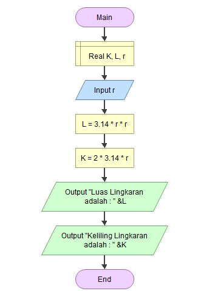
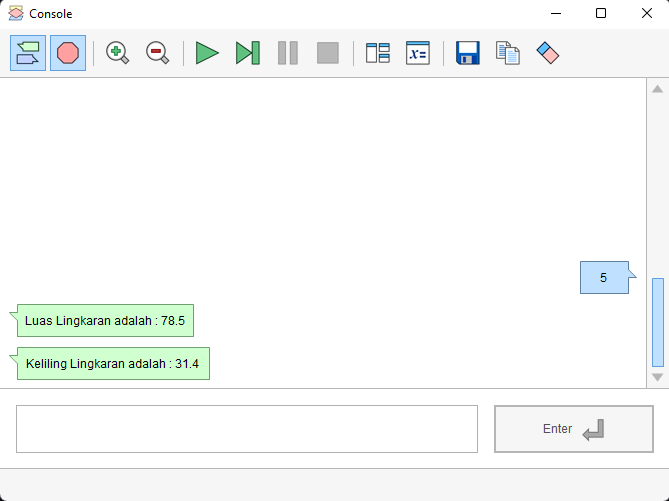
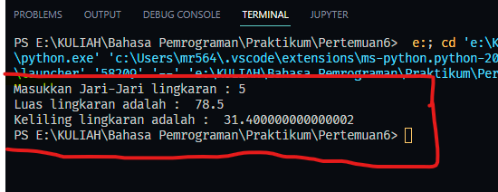
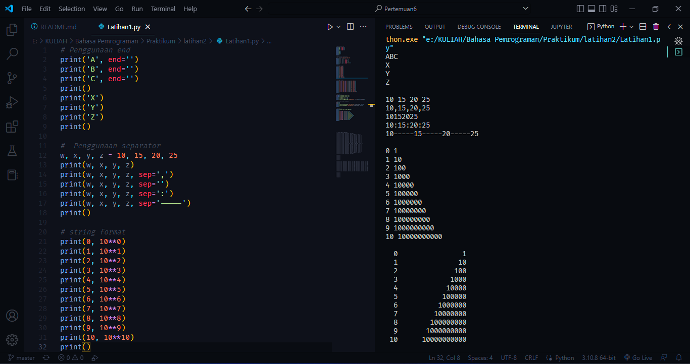
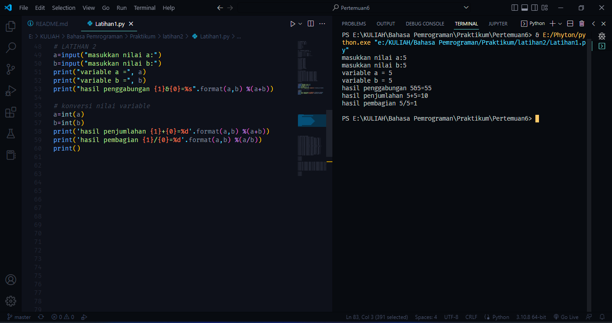
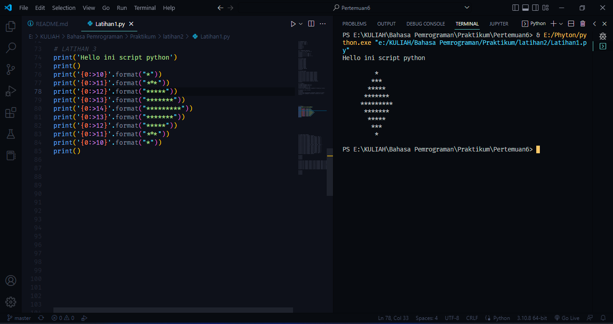

# Tugas Python Pertemuan 6 (Membuat program untuk menghitung luas dan keliling lingkaran menggunakan Python)
___
Nama    : Muhammad Rizky<br>
NIM     : 312210576<br>
Kelas   : TI.22.B2<br>
Mapel   : Bahasa Pemrograman<br>

**Daftar isi**
> * [Membuat Flowchart](#membuat-flowchart)
> * [Menerapkan Flowchart ke coding](#menerapkan-flowchart-ke-coding)
> * [ScreenShot Latihan Pertemuan 6](#screenshot-latihan-pertemuan-6)
  
## `Membuat Flowchart`
Disini saya akan membuat flowchart bagaimana cara membuat program untuk menghitung luas dan keliling lingkaran menggunakan Python menggunakan aplikasi [flowgorithm](http://www.flowgorithm.org/download/)



1. Buat sebuah Statement *deklarasi* untuk mendeklarasikan Variabel yang akan kita pakai.
    > disini saya mendeklarasikan variabel "K" untuk Keliling, "L" untuk Luas, dan "r" untuk jari-jari 
2. Lalu buat Statement *input* untuk memasukan inputan jari-jari sesuai dengan kemauan kita.
3. buat Statement *assign* dan masukkan rumus Luas dan Keliling Lingkaran untuk di proses oleh program.
4. terakhir buat Statement *output* untuk mengetahui hasil dari proses penghitungan Luas dan keliling lingkaran.
5. Hasil proses dari program diatas



## `Menerapkan Flowchart ke coding`
Disini saya akan menerapkan Flowchartnya menggunakan teks editor Visual Code dengan menggunakan bahasa pemrograman python.

1. Buat 1 file dengan format *.py*
   > Contoh : latihan1.py
2. Ketikan kode seperti di bawah ini
   
   ```python
    r = float(input("Masukkan Jari-Jari lingkaran : "))

    L = 3.14*r*r
    K = 2*3.14*r

    print("Luas lingkaran adalah : ", L)
    print("Keliling lingkaran adalah : ", K)
    ```
3. Lalu jalankan codenya dan hasilnya seperti dibawah ini



## `ScreenShot Latihan Pertemuan 6`
1. LATIHAN 1
   ```python
    # Penggunaan end
    print('A', end='')
    print('B', end='')
    print('C', end='')
    print()
    print('X')
    print('Y')
    print('Z')
    print()

    #  Penggunaan separator
    w, x, y, z = 10, 15, 20, 25
    print(w, x, y, z)
    print(w, x, y, z, sep=',')
    print(w, x, y, z, sep='')
    print(w, x, y, z, sep=':')
    print(w, x, y, z, sep='-----')
    print()

    # string format
    print(0, 10**0)
    print(1, 10**1)
    print(2, 10**2)
    print(3, 10**3)
    print(4, 10**4)
    print(5, 10**5)
    print(6, 10**6)
    print(7, 10**7)
    print(8, 10**8)
    print(9, 10**9)
    print(10, 10**10)
    print()

    # Stirng format
    print('{0:>3} {1:>16}'.format(0, 10**0))
    print('{0:>3} {1:>16}'.format(1, 10**1))
    print('{0:>3} {1:>16}'.format(2, 10**2))
    print('{0:>3} {1:>16}'.format(3, 10**3))
    print('{0:>3} {1:>16}'.format(4, 10**4))
    print('{0:>3} {1:>16}'.format(5, 10**5))
    print('{0:>3} {1:>16}'.format(6, 10**6))
    print('{0:>3} {1:>16}'.format(7, 10**7))
    print('{0:>3} {1:>16}'.format(8, 10**8))
    print('{0:>3} {1:>16}'.format(9, 10**9))
    print('{0:>3} {1:>16}'.format(10, 10**10))
    print()
   ```
    

2. LATIHAN 2
    ```python
    # LATIHAN 2
    a=input("masukkan nilai a:")
    b=input("masukkan nilai b:")
    print("variable a =", a)
    print("variable b =", b)
    print("hasil penggabungan {1}&{0}=%s".format(a,b) %(a+b))

    # konversi nilai variable
    a=int(a)
    b=int(b)
    print('hasil penjumlahan {1}+{0}=%d'.format(a,b) %(a+b))
    print('hasil pembagian {1}/{0}=%d'.format(a,b) %(a/b))
    print()
   ```
    
3. LATIHAN 3
    ```python
    # LATIHAN 3
    print('Hello ini script python')
    print()
    print('{0:>10}'.format("*"))
    print('{0:>11}'.format("***"))
    print('{0:>12}'.format("*****"))
    print('{0:>13}'.format("*******"))
    print('{0:>14}'.format("*********"))
    print('{0:>13}'.format("*******"))
    print('{0:>12}'.format("*****"))
    print('{0:>11}'.format("***"))
    print('{0:>10}'.format("*"))
    print()
   ```
    

